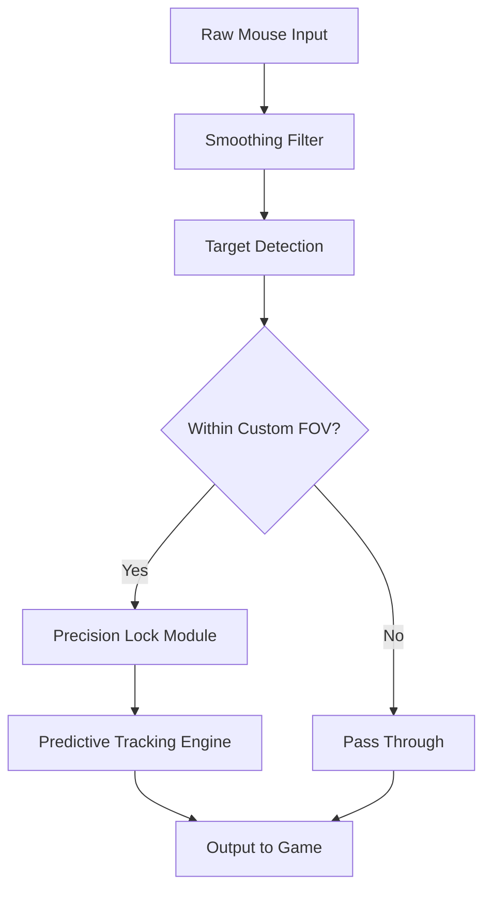

## ⚡️ Overview

The Splitgate Aim Assist module delivers adaptive precision locking, configurable smoothing, and granular weapon profiles. Unlike rigid snap tools, this system emphasizes natural tracking—letting your aim glide rather than jerk. You retain full agency, but with steadier momentum.

[!NOTE]
The build focuses heavily on micro-adjustment accuracy for rapid-movement firefights where opponents jump, slide, and portal-swap unpredictably.

---

## 🎯 Features

* **Adaptive auto-aim** with configurable smoothing curves (linear, elastic, pulse-soft).
* **Dynamic sensitivity profiles** for close-quarters, mid-range, and long-range portals.
* **Weapon-based tuning**, e.g., BR burst delay, Carbine recoil alignment.
* **Predictive motion tracking** for portal exits and air-strafe arcs.
* **Optional radar-view overlay** to complement your aim assist with spatial awareness.
* **Failsafe toggles** for instant disengage during high-motion maneuvers.

---

### Badges


---

## 🛠 Compatibility

| Component          | Support | Notes                                        |
| ------------------ | ------- | -------------------------------------------- |
| Windows 10/11      | ✔       | Full optimization for DirectX 11 builds      |
| Splitgate (Steam)  | ✔       | Auto-detect launcher                         |
| Controller Input   | ✔       | Optional magnetism tuning                    |
| Mouse Input        | ✔       | Advanced smoothing pipeline                  |
| Accessibility Mode | ✔       | Reduced-latency low-vision reticle highlight |

[!IMPORTANT]
Ultra-wide monitors require a recalibrated FOV sync. Use the `--uw-calibrate` flag during setup.

---

## ⚙️ Setup & Configuration

Follow these steps for clean initialization:

1. **Extract** the package into a root-level folder such as:

   ```
   C:\SG_AimModule\
   ```
2. **Launch** the config builder:

   ```
   SG_AimAssist.exe --boot
   ```
3. **Select a tracking profile** (recommended: *VelocitySoft v3* for beginners).
4. **Bind a toggle key** (default suggestion: `Mouse5`).
5. **Adjust tracking strength**, e.g.:

   ```json
   {
     "aim_strength": 0.42,
     "smoothing": 0.78,
     "fov_lock": 6,
     "predictive_portal": true
   }
   ```

### Example command-line injection

```
SG_AimAssist.exe --inject DX11 --profile portalCombat --vtrack 0.60
```

---

## 📊 Mermaid Diagram — Aim Flow Logic



---

## 👁 Enhanced Awareness (Optional Overlay)

Although the heart of this software is pure aiming, you may enable a minimal **portal-aware radar view**:

* Highlights movement through portals
* Displays angular velocity of targets
* Adjustable opacity via slider or hotkey

Use sparingly to avoid clutter—clarity often triumphs over information overload.

---

## ❓ FAQ

**Does this require special drivers?**
No, it operates within standard Windows HID routing.

**Will it affect my FPS?**
Typically under 2% load; the predictive engine is optimized for DX11.

**Can I make separate configs per weapon?**
Yes—profiles can auto-switch based on detection of weapon swaps.

**What’s the ideal smoothing for fast portal fights?**
Try 0.65–0.80 for hybrid strafing environments.

**Is update support included?**
The module includes a delta-patcher that fetches only changed segments, keeping downloads minimal.

---

## 🌀 Final Thoughts

Aiming in Splitgate is a dance of momentum and geometry—this tool simply steadies your steps. With flexible tuning, portal-aware prediction, and input-responsive behavior, the module becomes an invisible companion, whispering balance into your crosshair.

